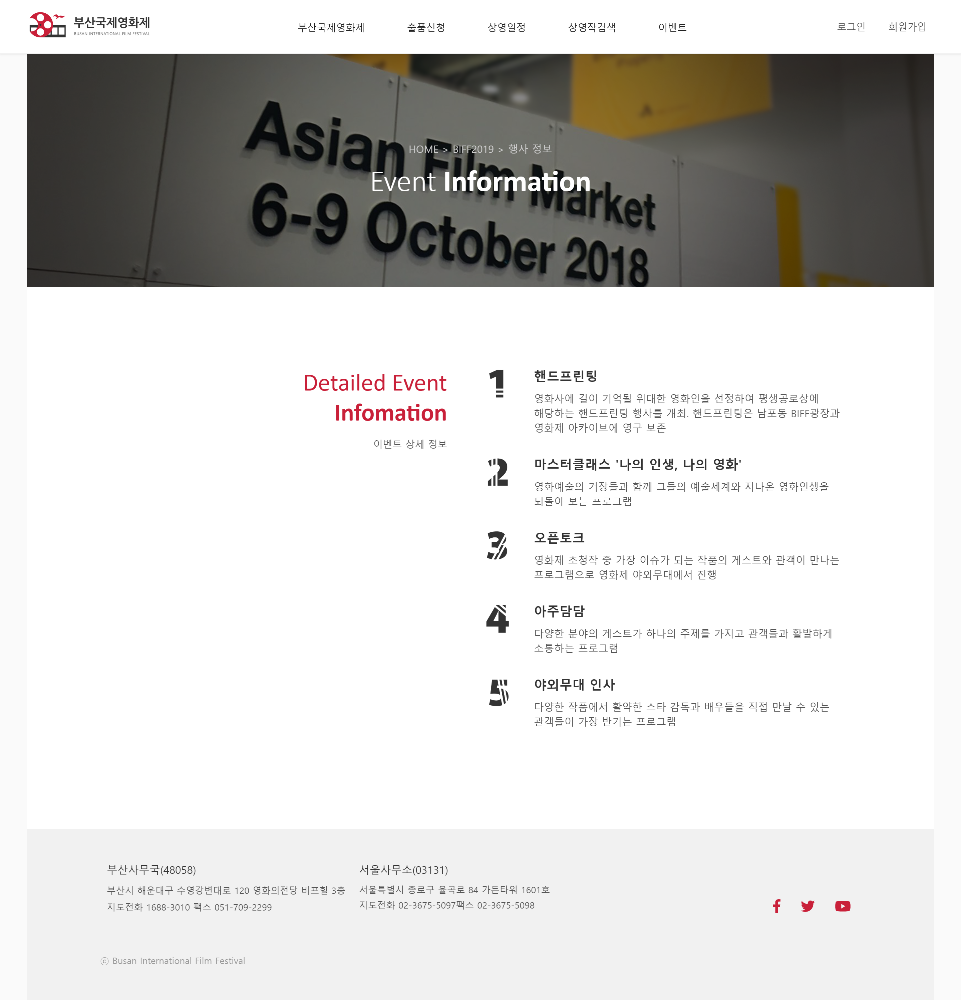

# 2019년 전국대회 과제 - 부산국제영화제

## 개요

이 프로젝트는 2020년 기능경기대회 준비를 목적으로 제작되었으며, 2019년 기능경기 전국대회 과제 문제를 베이스로 제작되었음을 알려드립니다. 과제 문제는 마이스터넷( https://meister.hrdkorea.or.kr/ )에서 다운로드 받을 수 있습니다.

## 과제 설명

부산국제영화제는 아시아 최대의 영화 축제로써 그 명성이 아시아를 넘어 전 세계적으로 그 영역을 넓혀 가고 있다. 부산국제영화제 주최 측은 이러한 세계적인 이목과 개최 규모에 부합하고 첨단 IT를 통해 영화제의 홍보 및 정보전달 역할의 확대 강화를 위해 국제 영화제의 주제와 감성에 어울리는 트랜디한 웹사이트를 제작하기로 하였다. 개발자는 고객사가 요구하는 디자인 및 웹 프로그램 기능을 정확히 이해하여 사이트 성격에 적합하게 개발 제작한다.

## 디자인 컨셉

주요 컨텐츠를 중앙으로 배치함으로써, 콘텐츠의 내용의 가독성을 높일 수 있도록 제작하였습니다. 부산국제영화제 원 사이트( http://www.biff.kr/kor/ )의 느낌을 살리되, 좀 더 심플하고 간결한 흐름으로 콘텐츠를 배치하였습니다.

## 디자인 키워드

모던하면서도 심플하지만 허전하지 않은 레이아웃

## 로고 디자인

로고는 부산과 영화제라는 콘셉을 살려서 필름과 갈매기의 형태로 구성해 보았습니다. 

    

## 페이지 스크린 샷

* [메인 페이지](#메인-페이지)
* [모바일 버전](#모바일-버전)
* [개최 개요](#개최-개요)
* [행사 안내](#행사-안내)

### [메인 페이지](#페이지-스크린-샷)

    

### [모바일 버전](#페이지-스크린-샷)

    

### [개최 개요](#페이지-스크린-샷)

    

### [행사 안내](#페이지-스크린-샷)

    

